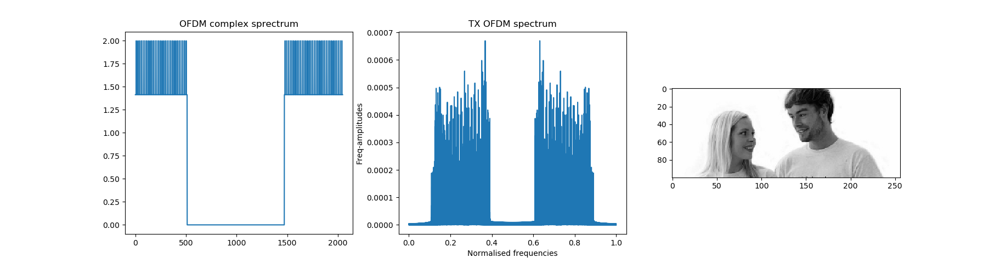
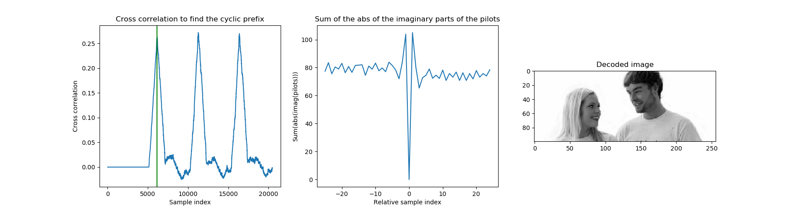

This repo has been moved. Please check out version 2.x here: 
https://github.com/dchutchings/py_ofdm

# Python OFDM transmitter and receiver

Features: Nyquist quadrature modulator, pilot tones and cyclic prefix.

## OFDM class

The module `ofdm_codec` contains methods to encode, decode
and to find the start of the symbol.

## Tx/Rx-Demo

An 256x100 grey value image is transmitted encoded as OFDM.
Every line of the image turns into a symbol. Thus we have
100 symbols which are transmitted.

### Transmission

Run `ofdm_tx.py`. This creates a wav file with the whole
image as OFDM encoded. You can listen to it!

### Reception

Run `ofdm_rx.py`. This then detects the start of the 1st symbol
1st with the cyclic prefix and then fine tunes it with the pilots.
Then it decodes the image.

